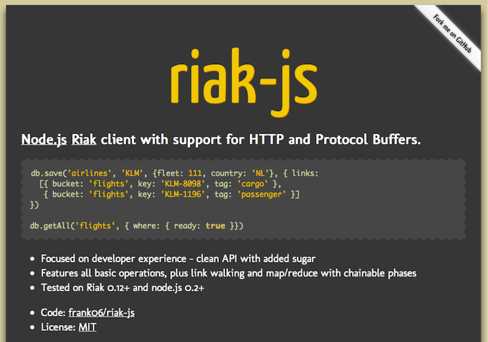

!SLIDE 
# [Centralized Logging](http://github.com/basho/riaktant) #

## With Node.js and [Riak Search](http://wiki.basho.com) ##

!SLIDE bullets incremental

# The Problem #

* Many Servers
* Many Logs
* Aggregate!

!SLIDE bullets

# Ingredients

* Node.js
* Syslog Protocol ([Glossy](https://github.com/squeeks/glossy))
* Riak Search (via [riak-js](http://riakjs.org))

!SLIDE bullets incremental

# Syslog ♥ Node.js #

* UDP
* There is no step 2

!SLIDE

    server = dgram.createSocket('udp4')
    server.on "message", (rawMessage) ->
      ...

!SLIDE smallest

# Syslog #

    <41>1 2011-02-13T23:36:21.353+01:00 lb.basho.com ntpd 4859 - Client process died before closing connection, cleaning up
    <154>1 2011-02-14T00:33:21.444+01:00 lb.basho.com ntpd 15023 - Client disconnected
    <25>1 2011-02-14T01:16:21.364+01:00 node5.riak.basho.com nginx 18418 - Client process died before closing connection, cleaning up
    <65>1 2011-02-14T02:36:21.470+01:00 node5.riak.basho.com nginx 22467 - Client disconnected
    <180>1 2011-02-14T03:00:21.409+01:00 web2.basho.com sshd 30201 - Client disconnected

!SLIDE small

# Parse with Glossy #

    syslogParser = require('glossy').Parse
    parsedMessage = syslogParser.parse message

!SLIDE smallest

# Parsed Message #

    { 
      originalMessage: '<180>1 2011-02-14T03:00:21.409+01:00 web2.basho.com sshd 30201 - Client disconnected',
      prival: 180,
      version: 1,
      facilityID: 22,
      severityID: 4,
      facility: 'local6',
      severity: 'warn',
      time: Mon, 14 Feb 2011 02:00:21 GMT,
      host: 'web2.basho.com',
      message: '30201 - Client disconnected'
    }

!SLIDE bullets incremental

# Riak #

* Distributed
* Fault-Tolerant
* Replicated
* Scales out linearly
* Flexible data model

!SLIDE

# Riak ♥ Node.js #

!SLIDE center

## <http://riakjs.org> ##

!SLIDE smallest

# Saving #

    riak = require("riak-js").getClient()
    message = {originalMessage: ""}
    riak.save "syslog", "ffb0731003eb63a744c1", message, (error, data) ->
      ...

!SLIDE smallest

# Fetching #

    riak.get "syslog", "ffb0731003eb63a744c1", (error, data, meta) ->
      console.log(data)

!SLIDE smallest

# Searching #

    riak.search "syslog", "disconnected", {rows: 10}, (error, data, meta) ->
      console.log(data.docs)

!SLIDE

# Aggregate #

!SLIDE smaller

# MapReduce #
## Extract Host Name ##

    map = (value) ->
      doc = Riak.mapValuesJson(value)[0]
      host = {}
      host[doc.host] = 1
      [host]

!SLIDE smaller

# MapReduce #
## Group By Hostname ##

    reduce = (values) ->
      result = {}
      for value in values
        for host in values[value]
          if host in result
            result[host] += values[value][host]
          else
            result[host] = values[value][host]
      [result]

!SLIDE smallest

# MapReduce #
## Fire!! ##

    riak.addSearch("syslog", "disconnected").map(map).reduce(reduce).run()

!SLIDE

## Throwing It All Together ##

!SLIDE bullets incremental

# [Riaktant](http://github.com/basho/riaktant) #

* Syslog Server
* Riak Search Backend
* Web UI for Log Analysis

!SLIDE bullets incremental

## Cue Demo Music ##

* Or go [here](http://basho.no.de) for live demo.
* User riak, Password awesomesauce

!SLIDE bullets incremental

# Warning #

* Syslog is UDP
* Experience Back Pressure
* ...and message drops

!SLIDE bullets incremental

# Solution #

* Don't block the event loop!
* Defer storing into Riak
* Drain queue regularly

!SLIDE bullets incremental

# The Future #

* Internal Pub/Sub
* Distribute Notification via Faye
* Pretty, Pretty Graphs

!SLIDE

# One more thing... #

!SLIDE smaller

    @@@ erlang
    -module(translate).
    -export([loop/0, translate/2]).

    loop() ->
      receive
        "casa" ->
          Pid ! "house",
          loop();
        _ ->
          Pid ! "What?",
          loop()
    end.

    translate(To, Word) ->
      To ! {self(), Word},
      receive
        Translation -> Translation
    end.
